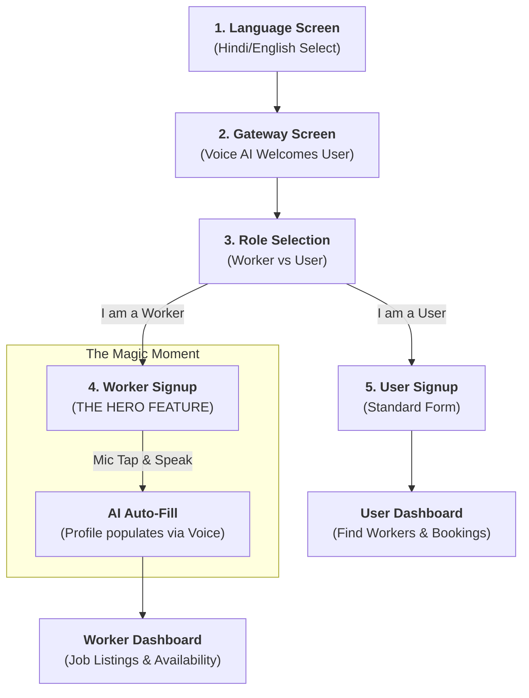

# VoiceHire - AI-Powered Job Marketplace

VoiceHire is a revolutionary platform designed to bridge the gap between local skilled workers and customers using advanced Voice AI. It focuses on accessibility, breaking literacy barriers with a voice-first interface.

## 🏆 Demo Workflow (The Hero Journey)

This workflow represents the core experience designed for both users and workers, specifically optimized for accessibility.

### 📋 Key Demo Steps
1.  **Language Selection**: Choose Hindi or English to set the context.
2.  **Voice Gateway**: An AI assistant greets the user, providing immediate voice guidance.
3.  **Role Selection**: Tap "I am a Worker" to see the most advanced feature.
4.  **Voice Profile Setup**: Tap the MIC button and speak (e.g., "Mera naam Rahul hai aur main ek Bijli wala hoon").
5.  **AI Auto-Fill**: Watch as the Name and Work fields populate automatically from the voice input.
6.  **Instant Dashboard**: Access specialized tools for job tracking and verification.

## 🛠️ Features
- **Voice-First Registration**: Profile creation via Speech-to-Text for non-literate workers.
- **Multilingual Support**: Fully operational in Hindi and English.
- **Smart Matching**: AI-driven connection between local needs and worker skills.
- **QR Verification**: HMAC-secured check-ins for job safety.

## 🚀 Technical Stack
- **Frontend**: React/Next.js with Tailwind CSS & shadcn/ui.
- **Backend**: Python Flask with Supabase integration.
- **Voice Engine**: Web Speech API with custom NLP for field mapping.

---
© 2026 VoiceHire AI.